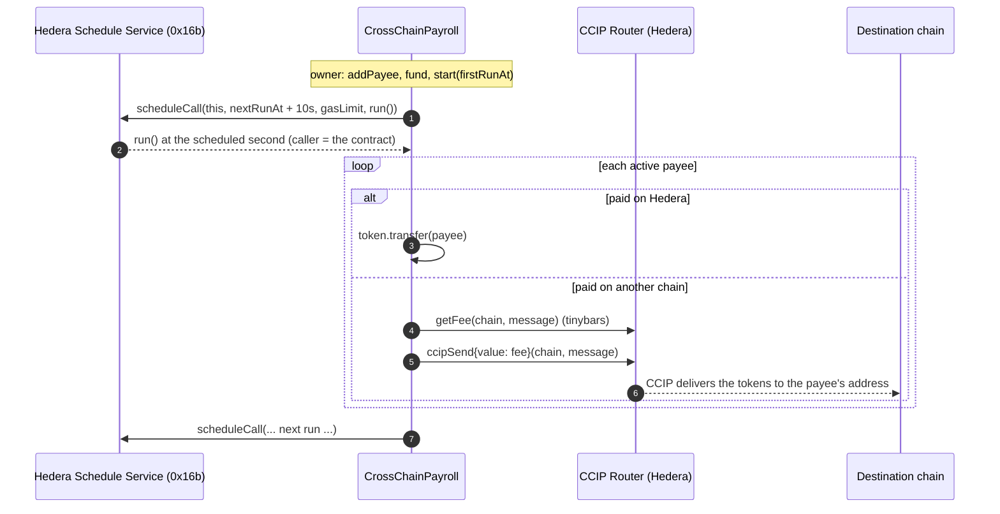

# CCIP Payroll

**Pay your team on the chain each person chooses, from a Hedera treasury, with no keeper.**

[](https://github.com/nickthelegend/scaffold-hbar-ccip-payroll/actions/workflows/ci.yaml)
[](https://scaffold-hbar-ccip-payroll.vercel.app)
[](LICENCE)

A [Scaffold-HBAR](https://github.com/hedera-dev/scaffold-hbar) template for recurring cross-chain payouts. `CrossChainPayroll` holds a payout token and HBAR on Hedera and, every interval, pays each payee **on Hedera or on another chain through [Chainlink CCIP](https://docs.chain.link/ccip)**, paying the CCIP fee in **native HBAR**. After each run the contract **schedules its own next run with the Hedera Schedule Service**, so payroll keeps going with nobody running a bot.

```bash
npm create scaffold-hbar@latest -- --template nickthelegend/scaffold-hbar-ccip-payroll
```

**Live:** [scaffold-hbar-ccip-payroll.vercel.app](https://scaffold-hbar-ccip-payroll.vercel.app) · contract [`0.0.10857591`](https://hashscan.io/testnet/contract/0.0.10857591) on Hedera testnet · every run below was executed by the network on schedule
**Demo video:** [watch (73 s)](https://ccip-payroll-demo.vercel.app) · [mp4](https://ccip-payroll-demo.vercel.app/ccip-payroll-demo.mp4)

| Payee | Paid on | How |
|---|---|---|
| Alice | **OP Sepolia** | CCIP token transfer, fee ≈ 2.6 HBAR |
| Carol | **Ethereum Sepolia** | CCIP token transfer, fee ≈ 36 HBAR |
| Bob | **Hedera** | token transfer |

One run, three chains, one transaction that nobody sent: the Hedera Schedule Service executed it.

## Contents

- [Why this exists](#why-this-exists)
- [Quickstart](#quickstart)
- [Live on Hedera testnet](#live-on-hedera-testnet)
- [How it works](#how-it-works)
- [The dashboard](#the-dashboard)
- [Configuration](#configuration)
- [Testing](#testing)
- [Run your own payroll](#run-your-own-payroll)
- [Hedera and CCIP specifics worth knowing](#hedera-and-ccip-specifics-worth-knowing)
- [Security model and limitations](#security-model-and-limitations)
- [Hedera Harness](#hedera-harness)
- [Project layout](#project-layout)

## Why this exists

Teams keep their treasury on Hedera but pay contributors who live on Ethereum, Optimism or elsewhere. Today that means someone bridging by hand every pay period, or a keeper bot that has to be run, funded, monitored and trusted. Each piece is hard on its own:

- **Moving value across chains safely** is what CCIP does: token pools burn or lock on Hedera and release on the destination, with Chainlink's Risk Management Network watching the lane. Building that yourself is not an option.
- **Paying for it** normally needs LINK or a wrapped gas token. Here the treasury pays CCIP in native HBAR, quoted on-chain by the router in tinybars.
- **Doing it on time without a bot** is what the Hedera Schedule Service (HIP-1215) gives a contract: `run()` asks the network to call `run()` again at the next pay date, and the network does.

The template is the smallest complete version of that: a contract you can read in one sitting, tests against mocks **and** against the real CCIP router, a dashboard that tracks every CCIP message to its destination, and a live testnet payroll that has paid three chains in a single scheduled run.

## Quickstart

### Prerequisites

- Node.js 22 LTS (≥ 20.19 works) and Yarn (via `corepack enable`)
- [Foundry](https://book.getfoundry.sh/getting-started/installation) **1.7.x** (`foundryup -i v1.7.1`). Forge 1.8+ sends block tags in a form Hedera's JSON-RPC relay rejects, which breaks the fork tests.
- For deploying your own: a funded Hedera testnet ECDSA account ([faucet](https://portal.hedera.com/faucet))

### 1. Scaffold and install

```bash
npm create scaffold-hbar@latest -- --template nickthelegend/scaffold-hbar-ccip-payroll
cd my-hedera-dapp
```

The CLI installs dependencies and the Foundry libraries. In a git clone, run `yarn install` and `git submodule update --init --recursive` instead.

### 2. Run the tests

```bash
yarn foundry:test                                     # 37 unit + fuzz tests (mock CCIP router, token registry and Schedule Service)
yarn foundry:test:testnet --match-path "test/fork/*"  # the real CCIP router and token registry on a Hedera testnet fork
yarn next:test                                        # run-history decoding, units, chains, CCIP status
```

### 3. Open the dashboard

```bash
yarn next:dev
```

Open http://localhost:3000. It reads the live testnet payroll out of the box: treasury, cost per run and runway, the pending schedule with a countdown, payees, and every run with its CCIP messages and their delivery status. To try a write, connect the burner wallet (top right), fund it with **Get testnet HBAR** (it starts empty and needs gas), then click **Add 1 CCIP-BnM** to top up the treasury from the public faucet.

### 4. Deploy your own

See [Run your own payroll](#run-your-own-payroll): deploy, add payees, fund, start, and watch the network execute your first run.

## Live on Hedera testnet

Everything below happened on Hedera testnet and was checked on the mirror node, the CCIP explorer and the destination chains. The dashboard shows the same data live.

### Deployment and setup

| What | Where |
|---|---|
| `CrossChainPayroll` | [`0.0.10857591`](https://hashscan.io/testnet/contract/0.0.10857591) · `0x5773b878d97E243A011AF1cE16BCBcc87968F468` · deploy [tx](https://hashscan.io/testnet/transaction/0x73ea84db2931a5340f4d0ef63489db7bdd59583c7117b51d3416242f30f8dffd) · [Sourcify](https://sourcify.dev/server/v2/contract/296/0x5773b878d97E243A011AF1cE16BCBcc87968F468) |
| Payout token | CCIP-BnM [`0xF8238FD7…bEb1`](https://hashscan.io/testnet/contract/0xF8238FD7Dd2bEbEDaa65c3974175d98e6110bEb1) |
| CCIP router | [`0x802C5F84…7Ce4`](https://hashscan.io/testnet/contract/0x802C5F84eAD128Ff36fD6a3f8a418e339f467Ce4) (Router 1.2.0, [CCIP directory](https://docs.chain.link/ccip/directory/testnet/chain/hedera-testnet)) |
| Payees | Alice `0xad7B4939…2A4E` on OP Sepolia ([tx](https://hashscan.io/testnet/transaction/0x48dfb946e7bf750106416ba21304d978f539e54e7fc04aefd206373817048fdf)), Bob `0x7121C972…2481` on Hedera ([tx](https://hashscan.io/testnet/transaction/0xc5546c4b07c362238a5fab695802a6ddbd731d529ecdd598d6e51184818b020a)) |
| Funding | 1 CCIP-BnM from the faucet ([tx](https://hashscan.io/testnet/transaction/0x12ffd736987d375aaed06bb73e08a36bc354d8dc636956c0c44fab484df1c6ea)), 80 HBAR for fees ([tx](https://hashscan.io/testnet/transaction/0xe2af959eba3b2fe4b04b30995cb29c2730bd7df2cda5c41ab9727566dae6ce93)) |
| `start` | [tx](https://hashscan.io/testnet/transaction/0x46537f3f3882602adf2ad3bb164eaecdbcc728c02765b5713d126d3a12a97f56): schedule [`0.0.10857602`](https://hashscan.io/testnet/schedule/0.0.10857602) with a 2.11M gas budget for two payees |
| Add Carol on Ethereum Sepolia **while running** | [tx](https://hashscan.io/testnet/transaction/0xbe97915f7d02ab1fd1790e207dc96c89a1c7fe1f246be440442c5c92a1414231): the bigger payroll needs more gas, so the contract deleted `0.0.10857602` and created [`0.0.10857604`](https://hashscan.io/testnet/schedule/0.0.10857604) for the same second with 2.56M |

### Runs executed by the network

| Run | Executed by | Payouts | CCIP delivery |
|---|---|---|---|
| **#1** · [tx](https://hashscan.io/testnet/transaction/0x8a721c2114f5763931be8776cebe927774246b44f2d7654cde82dd57ab3ff8aa) · 2.23M gas of 2.56M | schedule [`0.0.10857604`](https://hashscan.io/testnet/schedule/0.0.10857604) at its exact second; `byScheduleService = true` | Alice 0.1 → **OP Sepolia** (fee 2.56 ℏ) · Bob 0.05 → **Hedera** · Carol 0.1 → **Ethereum Sepolia** (fee 35.77 ℏ) | [`0xfdb1c1d4…`](https://ccip.chain.link/msg/0xfdb1c1d4ceba2d04684af9a41d0ba332194eccab95611976d608e5c5a50a053e) ✓ [OP Sepolia tx](https://sepolia-optimism.etherscan.io/tx/0xdc6715681e5d4e0659035ad06f992ec55712a06bc0a642db88efc59fab7a8611) · [`0x6fb59d44…`](https://ccip.chain.link/msg/0x6fb59d44dc5380a628af9267297cdffbc07cf9013a98f63029553f3d7ebe7ec4) ✓ [Sepolia tx](https://sepolia.etherscan.io/tx/0x756be307927152da971a8bf3e777cec0e6a6ba6cf8e621e34ae57885298544ee) |
| **#2** · [tx](https://hashscan.io/testnet/transaction/0x4dcbac44fc6f29b57d0fce2f733a6c7d664d32576e2e9cefbae4a6c9e9fd4027) · 1.90M gas of 2.11M | schedule [`0.0.10857655`](https://hashscan.io/testnet/schedule/0.0.10857655); `byScheduleService = true`. Run #1 had scheduled it for three payees; [pausing Carol](https://hashscan.io/testnet/transaction/0x71ab90d1567aa807eb3488212ca017662d7b939d9d163677051d5e63aa54bd37) replaced that schedule (`0.0.10857649`) with this smaller one | Alice 0.1 → OP Sepolia · Bob 0.05 → Hedera | [`0x313daf97…`](https://ccip.chain.link/msg/0x313daf97ce22441ea72fec4cc6dda2d1e88a5bf694c7c455649fad1d65b57274) ✓ [OP Sepolia tx](https://sepolia-optimism.etherscan.io/tx/0xc5ddece2c051ca373a60a3a69638baac20822b8a5a77ba14db4118ac0dd036b2) |
| **#3** | schedule [`0.0.10857745`](https://hashscan.io/testnet/schedule/0.0.10857745), pending for 11 Oct 2026 13:45 UTC (interval [set to weekly](https://hashscan.io/testnet/transaction/0xb7f16f6e23f3ca7bb6959ce0fbe93930764ed0a66593b30e0845f19f7405685c)) | Alice → OP Sepolia · Bob → Hedera | — |

Nobody sent runs #1 and #2: each was the scheduled call the previous transaction left with the Schedule Service. Afterwards Carol holds CCIP-BnM on [Ethereum Sepolia](https://sepolia.etherscan.io/token/0xFd57b4ddBf88a4e07fF4e34C487b99af2Fe82a05?a=0x4Cc1ED8A3501C8eD5Bfb81Bff7dd8F21FC9C0dfA) and Alice on [OP Sepolia](https://sepolia-optimism.etherscan.io/token/0x8af4204e30565df93352fe8e1de78925f6664da7?a=0xad7B4939Fe1d6ee776FB9Effc541351608752A4E). An [earlier deployment](https://hashscan.io/testnet/contract/0.0.10857223) of the template (before payee changes rebudgeted the pending run) ran the same flow twice more, with all three of its CCIP messages delivered.

## How it works



### A run's life

1. **Start.** The owner adds payees (`addPayee(account, chainSelector, amount, label)`, where selector `0` means Hedera), funds the contract with the payout token and HBAR, and calls `start(firstRunAt)`. The contract checks the Schedule Service for capacity at that second (searching up to 10 seconds ahead) and schedules `run()`.
2. **The network runs payroll.** At the scheduled second the Schedule Service executes `run()` with the contract itself as the caller. That's how the contract knows, and records in `RunExecuted.byScheduleService`, that no person or bot triggered it.
3. **Each payee is paid on their chain.** Hedera payees get a token transfer. Cross-chain payees get a CCIP token-only message to their EOA (`data` empty, gas limit 0, out-of-order execution allowed), with the fee quoted by the router and paid in HBAR from the treasury.
4. **Nothing stops the line.** If a payout can't be made (not enough tokens, not enough HBAR for the fee, or CCIP rejects it), the contract emits `PayoutSkipped` with the reason and carries on. One bad payee never blocks the others, and a run never reverts inside the Schedule Service, which would lose the next schedule.
5. **The next run is scheduled.** `nextRunAt` moves forward by `interval` (or restarts from now if the run was late, so there are no catch-up storms), and `run()` schedules itself again.
6. **Payee changes keep the budget right.** A schedule keeps the gas limit it was created with. When the owner adds or re-activates a payee (or deactivates one), the contract replaces the pending schedule with one budgeted for the new payee set, so the network never executes a run that is short of gas.
7. **Delivery.** CCIP commits and executes the message on the destination; the dashboard polls the CCIP explorer and shows Waiting → Success (or Failed) with the destination transaction.

### Hedera services and integrations used

| Integration | What it does here | Where |
|---|---|---|
| **Chainlink CCIP** (Router 1.2.0, CCIP-BnM token pool, TokenAdminRegistry) | Moves every cross-chain payout; quotes and charges the fee in native HBAR; the registry lets `addPayee` refuse a chain the payout token can't reach | `CrossChainPayroll._payout`, `canPayOn`, `contracts/ccip/` |
| **Hedera Schedule Service** (HIP-1215, `0x16b`) | The contract schedules its own next `run()`: `hasScheduleCapacity`, `scheduleCall`, `deleteSchedule` | `_scheduleNextRun`, `_cancelSchedule` |
| **Hedera smart contracts** (EVM, native HBAR) | Treasury, payee registry, fees paid from the contract's HBAR balance in tinybars | `CrossChainPayroll.sol` |
| **Mirror node** | Run and payout history, schedule entities, scheduled-transaction details | `packages/nextjs/utils/payroll/history.ts` |
| **CCIP explorer API** | Live delivery status of each message | `app/api/ccip/[messageId]/route.ts` |

## The dashboard

| Card | Shows |
|---|---|
| **Treasury** | CCIP-BnM and HBAR balances; the next run's cost (tokens + CCIP fees + the scheduled execution's own fee); **runway** in runs. Anyone can add 1 CCIP-BnM from the faucet or send HBAR. |
| **Schedule** | Running or paused, the interval, the next run with a live countdown, and the pending schedule entity on HashScan. If a schedule couldn't be created, it says so and offers **Run payroll now** once the run is due (it's permissionless). |
| **Payees** | Label, account, destination chain, amount per run, active or paused, and the last payout's status. |
| **Run history** | Each run, whether the Hedera Schedule Service executed it, and every payout with chain, amount, CCIP fee, message link and delivery status. |
| **Owner controls** | Only for the owner's wallet: add or update payees (chains the token can't reach are flagged before you submit), start, pause, set the interval, withdraw. |

`/payee/<address>` lists everything one address has been paid, across runs and chains.

## Configuration

`packages/nextjs/.env.example`:

| Variable | Default | Purpose |
|---|---|---|
| `NEXT_PUBLIC_HEDERA_TESTNET_RPC_URL` | `https://testnet.hashio.io/api` | JSON-RPC for reads and wallet transactions |
| `NEXT_PUBLIC_HEDERA_MAINNET_RPC_URL` | `https://mainnet.hashio.io/api` | Same, for mainnet |
| `NEXT_PUBLIC_WALLET_CONNECT_PROJECT_ID` | scaffold default | WalletConnect project id for production |

No server secrets are needed: the CCIP status route calls a public API.

`packages/foundry/script/Deploy.s.sol` reads these optional overrides:

| Variable | Default (Hedera testnet) |
|---|---|
| `CCIP_ROUTER` | `0x802C5F84eAD128Ff36fD6a3f8a418e339f467Ce4` |
| `TOKEN_ADMIN_REGISTRY` | `0xA6643e4f53ceABad16970e8592D4eF7fea49260a` |
| `PAYOUT_TOKEN` | CCIP-BnM `0xF8238FD7Dd2bEbEDaa65c3974175d98e6110bEb1` |
| `PAYROLL_INTERVAL` | `604800` (7 days; minimum 60) |

## Testing

| Suite | Command | What it proves |
|---|---|---|
| Unit + fuzz (37) | `yarn foundry:test` | Scheduling (first run, next run, capacity failures, Schedule Service errors, manual runs deleting stale schedules, scheduled runs not deleting their own, payee changes rebudgeting the pending run), payouts on Hedera and via CCIP (message shape, fee, tokens pulled), every skip reason with the others still paid (including a token refusing a Hedera transfer), lanes the token can't travel refused, owner-only management, and a fuzz test that a funded run pays exactly the active amounts |
| Fork (2) | `yarn foundry:test:testnet --match-path "test/fork/*"` | Against the **real** router and TokenAdminRegistry: OP Sepolia and Ethereum Sepolia are accepted, Base Sepolia is refused (the router has the lane, the token's pool doesn't), and a run is quoted in tinybars of native HBAR |
| Frontend | `yarn next:test` | Log decoding and run grouping (including a real mirror-node log), tinybar/weibar/token units, chain names, CCIP status mapping and the status route |
| Live | [Live on Hedera testnet](#live-on-hedera-testnet) | Real scheduled runs, real CCIP deliveries |

A full `ccipSend` can't run on a plain fork: the router wraps the HBAR fee through WHBAR, which calls the HTS system contract (`0x167`) that a fork doesn't have. That's why the send path is proven on testnet instead.

## Run your own payroll

```bash
yarn foundry:account:import            # or foundry:account:generate, then fund it at the faucet
yarn foundry:deploy --network hedera_testnet
```

Deploying regenerates `packages/nextjs/contracts/deployedContracts.ts`, so the dashboard switches to your payroll. The payroll starts **paused**. Then, from the dashboard's Owner controls (or `cast`):

1. **Add payees.** Pick Hedera, OP Sepolia or Ethereum Sepolia for CCIP-BnM; the panel warns about chains the token can't reach.
2. **Fund it.** Add CCIP-BnM (the faucet button mints 1 per click) and send HBAR for fees. Budget per run: the CCIP fee of each cross-chain payee (about 2.6 HBAR to OP Sepolia, 36 to Ethereum Sepolia today) plus about 1.5–2.5 HBAR for the scheduled execution itself.
3. **Start.** Pick the first run time. A minute or two ahead is fine for a demo, and the countdown shows when the network will execute it.

For a real token, deploy with `PAYOUT_TOKEN=<token>` and check the token's pool lanes: `canPayOn(selector)` on your deployment, or `TokenPool.getSupportedChains()`.

## Hedera and CCIP specifics worth knowing

- **Units.** HBAR inside the EVM (CCIP fees, `quoteRun`, `withdraw(address(0), …)`) is **tinybars** (8 decimals). A wallet transaction's `value` and `eth_getBalance` are **weibars** (18 decimals). The router's native fee comes back in tinybars, and the contract pays exactly that.
- **Scheduling costs a flat ~1.41M gas** (measured; the contract budgets `SCHEDULE_NEXT_GAS` = 1.45M for margin). Creating a schedule through `0x16b` costs about the same whatever the scheduled call's own gas limit, and Hedera bills at least 80% of a transaction's gas limit. So `runGasLimit()` adds measured per-payout costs to that and nothing more (a three-payee run used 2.23M of its 2.56M budget on testnet).
- **Scheduled `block.timestamp` lags.** Inside a scheduled execution `block.timestamp` is the start of the ~2 s block and can read before the scheduled second. Runs are therefore scheduled 10 s after `nextRunAt`, and a scheduled run is recognised by its caller rather than by time.
- **Check the token's lanes, not just the router's.** The router lists every lane from Hedera; each token pool decides which of them the token can travel. Hedera testnet still registers an older CCIP-BnM (`0x01Ac…`) whose Ethereum Sepolia side rejects it (`InvalidSourcePoolAddress`), which is why this template uses `0xF823…` and checks the pool in `addPayee`.
- **Mirror-node log queries** filtered by topic must cover ≤ 7 days and are paged with `links.next`.
- **Debug a run** with `https://testnet.mirrornode.hedera.com/api/v1/contracts/results/<txHash>/actions`. It shows the router, onRamp, token pool and `0x16b` calls with gas and revert data.

## Security model and limitations

- **Owner powers.** The owner adds, updates and deactivates payees, starts and pauses payroll, changes the interval and can withdraw the treasury: it's the employer's money. Anyone can trigger a run that is due, but nobody can choose recipients or amounts at run time.
- **Reentrancy.** `run` and `withdraw` are `nonReentrant`; the router allowance is set per payout and cleared if a send fails.
- **Liveness.** If the treasury runs out of HBAR, the scheduled execution itself fails and the chain of schedules stops. The dashboard shows runway and offers a permissionless **Run payroll now** once a run is due, which restarts the cadence.
- **Delivery is asynchronous.** A successful `ccipSend` means the message left Hedera. Delivery is tracked off-chain (CCIP explorer), and a failed execution on the destination can be retried manually from the CCIP explorer.
- **Testnet token.** CCIP-BnM is a test token. A production payroll would use a token with a CCIP pool on the lanes you need (for example a stablecoin registered as a CCT).
- **Not audited.** This is a template. Review it before holding real funds.

## Hedera Harness

The repo ships a [Hedera Harness](https://github.com/hedera-dev/hedera-harness) recipe in `.harness/`. The harness gives an AI coding agent the context to change the template safely, and tiered validation to check its work:

| File | Role |
|---|---|
| `.harness/spec.yaml` | Recipe: baseline commands, validators, acceptance contract, Tier 3.5 chain validation (an ephemeral funded testnet signer) |
| `.harness/prd.md` | Product requirements the agent works against |
| `.harness/acceptance-contract.json` | User journeys: dashboard, schedule, run history, payee page, top-up |
| `.harness/validators/static.json` | Required files and docs, no committed `.env`, the contract still uses `scheduleCall`, `hasScheduleCapacity`, `ccipSend`, `getFee` |
| `.harness/validators/yarn.json` | Commands that must pass with no secrets: install, lint, contract tests, frontend tests, build |
| `.harness/validators/playwright-smoke.yaml` | Starts the production build and loads `/`, a payee page, `/debug` and `/api/health` |

```bash
yarn harness:validate   # static checks + every yarn command + Playwright route gate; no secrets needed
yarn harness:doctor     # checks the recipe and the host; Tier 3.5 needs HEDERA_OPERATOR_ID / HEDERA_OPERATOR_KEY
```

CI runs `yarn harness:validate` on every push, after the contract, fork and frontend tests.

## Project layout

```
packages/
  foundry/
    contracts/CrossChainPayroll.sol        treasury, payees, CCIP payouts, self-scheduling
    contracts/ccip/                        Client + IRouterClient + ITokenAdminRegistry (vendored subsets)
    contracts/interfaces/                  Hedera Schedule Service (HIP-1215)
    script/Deploy.s.sol                    Hedera testnet CCIP addresses, env overrides
    test/CrossChainPayroll.t.sol           unit + fuzz (mocks in test/mocks/)
    test/fork/                             real router and registry on a testnet fork
  nextjs/
    app/page.tsx                           payroll dashboard
    app/payee/[address]/page.tsx           one payee's payouts
    app/api/ccip/[messageId]/route.ts      CCIP explorer proxy
    components/payroll/  hooks/payroll/  utils/payroll/   UI, thin hooks, pure tested logic
.harness/                                  Hedera Harness recipe and validators
AGENTS.md                                  briefing for coding agents
```

## License

MIT, see [LICENCE](LICENCE).
